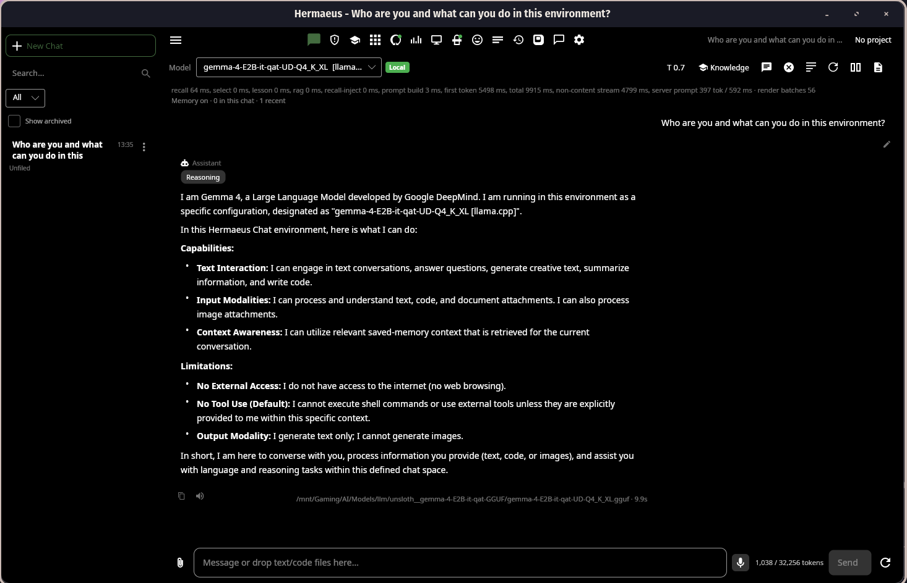
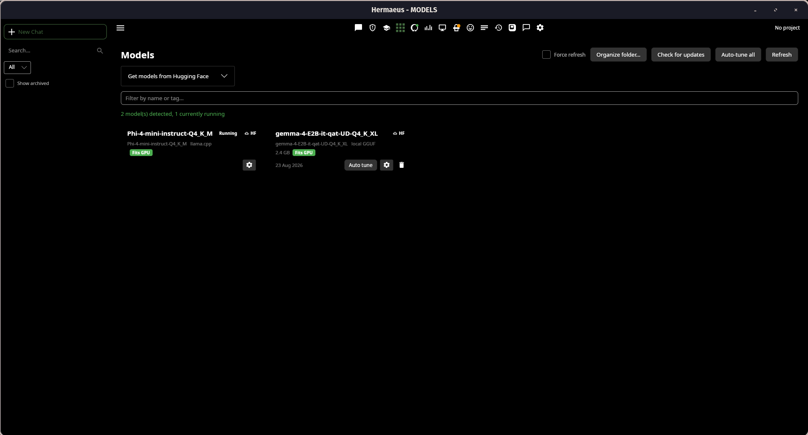
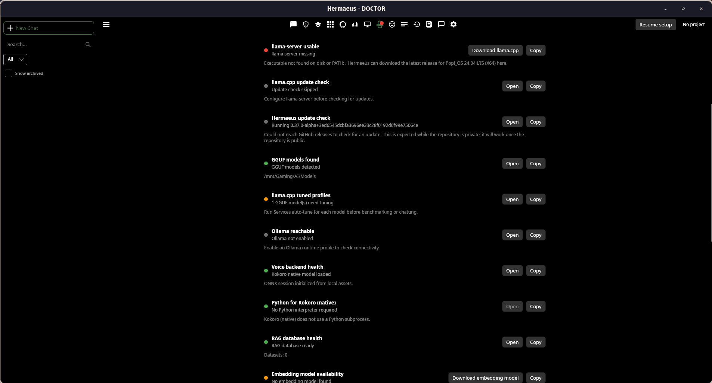
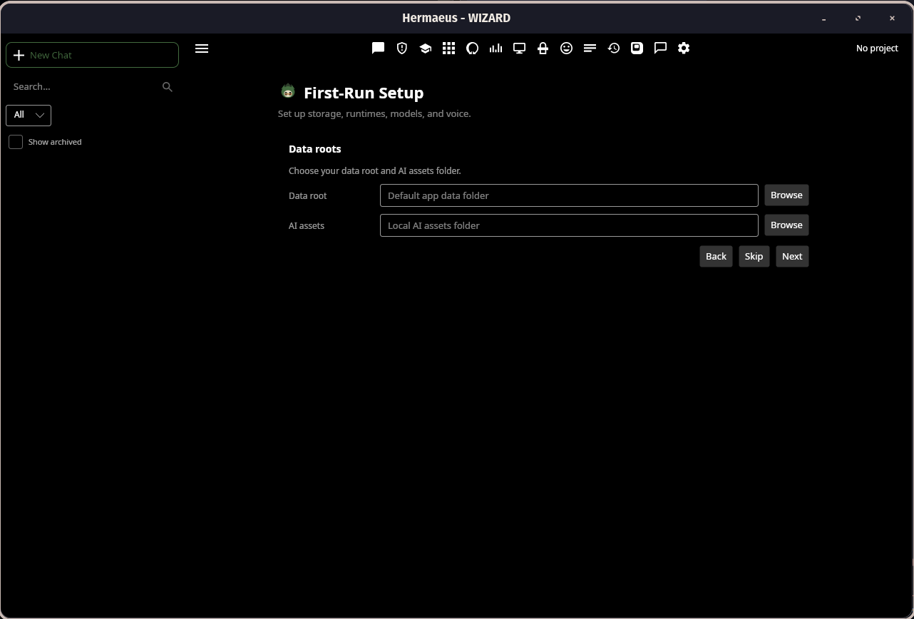

# Hermaeus

[](https://github.com/MortisDei/hermaeus/actions/workflows/ci.yml)
[](https://github.com/MortisDei/hermaeus/releases)
[](LICENSE.md)
[](https://dotnet.microsoft.com/download/dotnet/10.0)
[](docs/packaging.md)

Hermaeus is a native, local-first AI workspace for developers and power users.

Hermaeus manages the local AI system around conversation: model and runtime configuration, RAG and knowledge, long-term memory, supervised agents, benchmarking, diagnostics, observability, and optional voice services. It is a desktop application where those operations remain transparent, reviewable, and under the user's control.

Built with **Avalonia UI** and **.NET 10**. Continuous integration runs on Windows and Linux. Pop!_OS (Wayland) is a real-use target; other Linux environments are less exercised.

The application is real and actively dogfooded, not just a collection of service
adapters. This Chat capture shows a local Gemma 4 model running through
`llama.cpp`, with the runtime and model attribution visible in the UI:



*Chat with a local model, including runtime attribution, context awareness, and
explicit boundaries around web and tool access.*

---

## Why Hermaeus?

Most AI desktop applications focus on chat.

Hermaeus treats chat as just one part of a larger local AI workspace.

Core design principles:

- **Local-first**. Your models, data, and workflows stay on your machine whenever possible.
- **Transparent**. Context, memory, citations, traces, and runtime behaviour are visible instead of hidden.
- **User-controlled**. Destructive actions require explicit approval. Services are managed rather than assumed.
- **Provider-agnostic**. Use `llama.cpp`, Ollama, OpenAI-compatible APIs, local RAG, and multiple voice providers through a consistent interface.
- **Native desktop experience**. Built with Avalonia instead of embedding a browser.

---

## Major Features

### Chat Workspace

- Native markdown rendering
- Virtualized conversations
- Syntax-highlighted code blocks
- File attachments
- Context Inspector and a per-answer context receipt
- Conversation branching: regenerate and edit without losing the original
- Conversation search
- Long-term memory integration
- Token and context tracking

### Projects

A named container - folder root, default chat model, default RAG dataset,
default system prompt - that Chat, the Agent Workbench and RAG all read from.
Switching the active project sets that context everywhere at once.

### Recall and the command palette

One local search index over your own words in Hermaeus: past messages, agent
tasks, memories and document chunks, fused into a single ranked result. The
command palette (**Ctrl+K**) searches Recall alongside every registered app
command, so an empty query is a browsable index of what the app can do.

Recall ships with a visible switch, a real "Clear index" action, per-conversation
exclusion and honest size reporting.

### Activity

An outcome record for work that finishes somewhere you are not looking:
ingests, refreshes, model downloads, backups and restores, memory sweeps, the
voice backend, managed servers. Facts the app observed, not a model-written
summary. A row that names a specific artifact opens it; one that does not stays
inert rather than offering a link that goes nowhere.

### Constrained output

Where Hermaeus needs a reply in a particular shape, the shape is enforced by
the provider's sampler rather than requested in the prompt. The agent's action
protocol and memory auto-summary both use it, which is what makes a small local
model a viable driver for them. Providers that cannot enforce a shape say so at
the call site instead of silently sending an unconstrained request, and every
existing fallback stays for them.

### Memories

A reviewable store of durable facts, with hybrid retrieval, per-scope
organisation, and explicit control over what is kept and what is forgotten.

### Local AI Runtime Management

- Managed `llama.cpp` / `llama-server`
- Ollama support
- OpenAI-compatible providers
- Model profiles
- Runtime profiles
- GPU auto-tuning
- Runtime diagnostics
- Local AI setup wizard
- Speculative decoding, composable: n-gram drafting and draft-model drafting
  (including MTP heads) can be combined, and an incompatible draft model is
  refused before the server starts rather than after
- Complete model downloads: shards, vision projectors and MTP draft heads
  arrive together, each model in its own folder

The Models workspace is where local files and provider-discovered models are
reviewed, organized, tuned, and managed:



*Models lists local model provenance and runtime state, with management and
auto-tuning actions in the same workspace.*

### Local RAG

- Structure-aware chunking
- Markdown, code and PDF support
- Hybrid retrieval
- Multi-variant query planning
- ONNX reranking
- Budget-aware context packing
- Watched sources: datasets notice when their source files change instead of
  rotting silently
- Index size shown against the in-memory budget, so a corpus outgrowing it is
  visible while it grows rather than discovered later as a slow query
- Source citations
- Retrieval traces
- Native evaluation harness

### Agent Workbench

A supervised local agent designed around explicit user control.

The workbench is a status line, a pinned strip for whatever decision the agent
is waiting on, and four tabs: Run, Changes, Workspace, History. The decision is
never behind a tab, the panel opens on Run every time, and it never switches
tabs under you.

Features include:

- Read-first workflow
- A review queue that lists only what needs a decision now
- A finished run that says what it did: files, commands, approvals, and what it
  could not confirm
- Capability text derived from the real tool set and this workspace's own rules
- Workspace memory
- Context packs
- Safety gates
- Tool approval
- Local traces
- Lessons
- Task history
- Workspace profiles

### Voice

Pluggable voice providers including:

- Kokoro
- F5-TTS
- XTTS v2
- OpenAI Voice

Supports local playback, cloning workflows, provider-specific configuration, and managed runtime setup.

Speech recognition runs in-process on a local Whisper model: dictation anywhere
text goes, transcription of an audio file, and an optional hands-free
conversation mode. Transcripts carry punctuation and casing, and the language is
detected rather than assumed. Captured audio is transient - transcribed, then
deleted, never persisted and never attached to a conversation.

### Benchmarking

Evaluate models using practical local benchmark suites.

Includes:

- First-token latency
- Throughput
- Deterministic quality checks
- Ranking profiles, compared only across cases every model actually ran
- Best across every suite, by mean per-suite standing, so a large suite cannot
  outvote a small one and there is no winner when there cannot honestly be one
- Historical comparisons
- Speed Check: a fixed suite for measuring tokens per second, and a comparison
  between two runs of it with the configuration difference that separates them.
  How much speculative decoding helps depends on the model pair and the content,
  so this measures it rather than assuming it
- CSV / JSON / Markdown export
- Managed model switching
- System overview

### Diagnostics

Built-in tooling for running local AI reliably.

Includes:

- Hermaeus Doctor
- Trust & Safety checks
- Runtime health and runtime Logs
- GPU detection
- Storage analysis
- Backup and restore
- Migration tools
- A Settings page for preferences, kept separate from the Services page that
  manages processes and files on disk

Doctor reports what is ready, missing, or needs attention, with the relevant
remediation action alongside the check:



*Doctor exposes runtime, model, voice, and RAG readiness instead of hiding
operational problems behind a generic connection error.*

---

# Quick Start

## Use a release archive

Download the archive and matching `.sha256` file for your platform from the
[latest GitHub Release](https://github.com/MortisDei/hermaeus/releases/latest).
Release builds currently provide framework-dependent `linux-x64` `.tar.gz` and
`win-x64` `.zip` archives. They require the .NET 10 runtime unless a future
release explicitly says it is self-contained.

Linux:

```bash
sha256sum -c hermaeus-<version>-linux-x64.tar.gz.sha256
tar -xzf hermaeus-<version>-linux-x64.tar.gz
./hermaeus-<version>-linux-x64/install-desktop.sh
```

Windows PowerShell:

```powershell
Get-FileHash -Algorithm SHA256 hermaeus-<version>-win-x64.zip
Get-Content hermaeus-<version>-win-x64.zip.sha256
```

Compare the displayed hash with the companion checksum file, extract the
archive, then double-click `Hermaeus.exe`. It is the small open-source package
launcher for the actual application under `app\Hermaeus.Desktop.exe`. Release
binaries are unsigned, so verify the checksum before accepting an
operating-system warning.

After starting Hermaeus, use **Services** to configure a runtime, select a
model, and start Chat. The in-app setup wizard can download a starter model.
See the [user guide](docs/user-guide.md) for first-launch and troubleshooting
workflows.

On first launch, onboarding guides the initial data-root, runtime, model, and
voice setup:



*First-run setup keeps storage and local AI asset locations explicit.*

## Build from source

Install the [.NET 10 SDK](https://dotnet.microsoft.com/download/dotnet/10.0),
then clone and run the desktop project. A local model runtime is configured
later in-app via the setup wizard.

```bash
git clone https://github.com/MortisDei/hermaeus.git
cd hermaeus
dotnet run --project src/Hermaeus.Desktop
```

## Screenshots

The release captures above are from the working desktop application. They are
placed beside the workflows they demonstrate rather than collected as a
gallery.

---

# Supported Runtimes

## llama.cpp

Managed locally through the Services workspace.

- OpenAI-compatible endpoints
- Automatic localhost binding
- GPU auto-tuning
- Per-model launch profiles

## Ollama

- Runtime profiles
- Local model discovery
- `/api/chat`
- `/api/tags`

## OpenAI-compatible APIs

Supports any provider exposing the standard OpenAI Chat Completions API.

API keys are stored as secure Hermaeus secret references.

---

# Security

Hermaeus is designed around a local-first security model.

Highlights include:

- Localhost-only managed services
- Shell-free process execution (`ProcessStartInfo.ArgumentList`)
- OS credential-store integration
- Encrypted local fallback secret vault
- SHA256 verification for managed downloads
- Trust & Safety scanning
- Backup and restore safeguards
- Versioned SQLite schema migrations
- Data migration validation
- Security review and documented threat model

See **docs/security-review.md** for the complete engineering review, and **SECURITY.md** to report a vulnerability.

The automated regression suite runs in Windows and Linux CI, with warnings
treated as build errors.

---

# Known Issues / Beta Status

Hermaeus is beta software, developed and tested primarily on Windows. Linux (Pop!_OS, Wayland) has been run and works, but is less exercised than Windows and more likely to surface rough edges. Prebuilt binaries are not code-signed; Windows SmartScreen will warn on first run (verify the published SHA256 instead of dismissing it blindly). See `CHANGELOG.md` for the pace of fixes and new features.

Hermaeus has one maintainer. Issues get a best-effort response; pull requests must follow `CONTRIBUTING.md`.

---

# Documentation

Start with the [documentation map](docs/index.md). It explains which document
is authoritative for current product behavior, where subsystem references live,
how the active R31 material differs from historical review records, and where
deferred work is tracked.

- [Current feature catalogue](docs/features.md), including Chat, Agent, RAG,
  Models, Services, Benchmarks, Lab, System, Doctor, Memories, Logs, Activity,
  and Settings
- [User guide](docs/user-guide.md)
- [Packaging and installation](docs/packaging.md)
- [Current security review](docs/security-review.md)
- [Active deferred ledger](docs/review/deferred.md)
- [Development and contribution guidance](CONTRIBUTING.md)

Detailed subsystem references, the security roadmap, historical security
records, and the immutable review archive are linked from the documentation map.

---

# Project Structure

```
src/
├── Hermaeus.Core/
├── Hermaeus.Agent/
├── Hermaeus.Rag/
├── Hermaeus.Services/
├── Hermaeus.ViewModels/
├── Hermaeus.Desktop/
└── Hermaeus.Tests/

docs/
```

---

# Building

```bash
dotnet build Hermaeus.sln

dotnet test src/Hermaeus.Tests/Hermaeus.Tests.csproj

./build.sh

pwsh ./build.ps1
```

Packaging scripts create Linux `.tar.gz` and Windows `.zip` archives under
`dist/`. `--skip-restore`/`-SkipRestore` is only for a workspace already
restored for the requested runtime identifier; see
[Packaging](docs/packaging.md).

---

# License

Hermaeus is source-available.

Private and non-commercial use is licensed under the **PolyForm Noncommercial License 1.0.0**.

Commercial use requires a separate commercial licence.

See:

- LICENSE.md
- COMMERCIAL.md
- NOTICE.md

Hermaeus is **not** an OSI-approved open source project.

Support development on [Ko-fi](https://ko-fi.com/mortisdei).

For commercial licensing requests, see the Contact section of COMMERCIAL.md.

---

# Current Status

Current version:

**0.38.0-beta**

Major systems currently implemented include:

- Native desktop chat
- Managed local runtimes
- Local RAG
- Agent Workbench
- Long-term memory
- Voice providers
- Benchmark suites
- Controlled, isolated Lab experiments and evidence inspection
- Local AI setup
- Doctor diagnostics
- Reasoning-aware local chat with capability evidence and preserved reasoning
- Shared per-model context and KV-cache defaults
- Safe model adoption, progress, and deletion workflows
- Security review and threat model

Hermaeus is beta software. See [Known Issues](#known-issues--beta-status) below and `CHANGELOG.md` for the current state and improvement cadence. Public release hardening continues in the areas of installer signing, OCR support, additional security tightening, and Linux global hotkeys.
